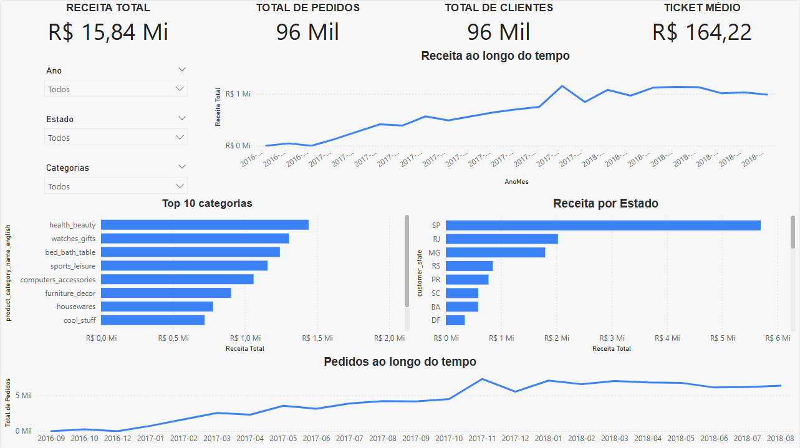

# 📊 Dashboard de Vendas E-commerce | Power BI

## 📌 Sobre o projeto
Este projeto apresenta um dashboard interativo desenvolvido no Power BI com o objetivo de analisar dados de vendas de um e-commerce.

A análise foi construída para responder perguntas de negócio como:

- Como a receita evolui ao longo do tempo?
- Quais estados geram mais receita?
- Quais categorias de produtos são mais relevantes?
- Como o volume de pedidos se comporta?

---

## 📊 Principais análises

### 📈 Evolução da Receita
Análise da receita ao longo do tempo, permitindo identificar tendências, crescimento e possíveis sazonalidades.

### 🗺️ Receita por Estado
Visualização da distribuição geográfica das vendas, destacando os estados com maior faturamento.

### 🏆 Top 10 Categorias
Identificação das categorias de produtos que mais contribuem para a receita total.

### 📦 Evolução dos Pedidos
Análise do volume de pedidos ao longo do tempo, permitindo comparação com a receita.

---

## 🎯 KPIs analisados

- Receita Total
- Total de Pedidos
- Total de Clientes
- Ticket Médio

---

## 🛠️ Ferramentas utilizadas

- Power BI
- DAX (Data Analysis Expressions)
- Modelagem de Dados

---

## 📷 Dashboard

---

## 📌 Conclusão

O dashboard permite uma visão clara do desempenho das vendas, ajudando na identificação de padrões e oportunidades de melhoria no negócio.

---

## 👨‍💻 Autor

Igor Rocha
